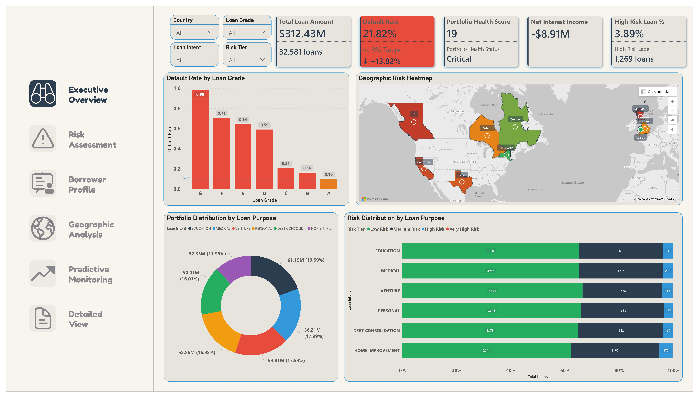
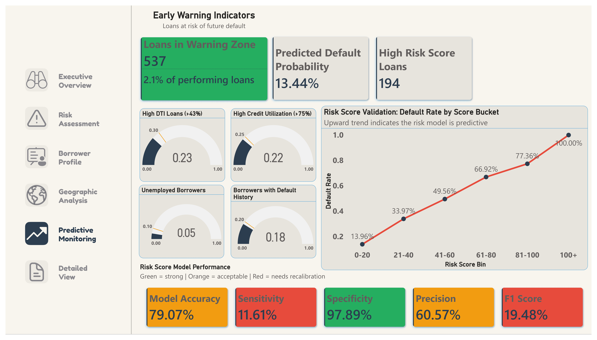

# Nova Bank Credit Risk Analytics

## Project Overview

This project delivers a comprehensive credit risk intelligence system built on Nova Bank's consumer lending portfolio: a 32,581-loan book spanning the USA, UK, and Canada, representing $312.43M in total principal exposure across six loan purposes and seven risk grades.

The analysis spans the full BI lifecycle: raw data transformation in Power Query, a purpose-built star schema in Power BI, a 50+ measure DAX layer, and a six-page interactive dashboard built for both executive decision-making and deep credit risk investigation.

The findings reveal a portfolio operating at more than double its target default rate, with systemic risk distributed uniformly across all geographies, demographics, and loan purposes, pointing to structural underwriting gaps rather than isolated problem segments.

> Portfolio Health Score: 19/100 (Critical)
> Default Rate: 21.82% | Target: 8% | Net Interest Income: -$8.91M

---

## Dashboard Pages

| Page | Purpose |
|------|---------|
| Executive Overview | Portfolio health KPI cards, grade performance, geographic heatmap, and risk distribution |
| Risk Assessment | Default rate matrix, risk score distribution, DTI vs LTI scatter, employment and credit history analysis |
| Borrower Profile | Demographic KPIs, age and income segmentation, home ownership analysis, borrower persona treemap |
| Geographic Analysis | Drill-down global risk map (country to state to city), country comparison, city-level performance table |
| Predictive Monitoring | Early warning KPIs, risk score validation, early warning gauges, model performance metrics |
| Detailed View | Drill-through landing page with dynamic context banner, segment KPIs, individual borrower table |

---

## Live Dashboard

[View the interactive dashboard here](https://app.powerbi.com/)

---

## Dataset

| Attribute | Detail |
|-----------|--------|
| Source | Onyx Data — Credit Risk Dataset, September 2025 |
| Total Records | 32,581 loans |
| Raw Columns | 29 fields |
| Countries | USA, UK, Canada |
| Loan Purposes | Education, Medical, Venture, Personal, Debt Consolidation, Home Improvement |
| Loan Grades | A through G |

---

## Technical Architecture

### Power Query — Data Pipeline

The raw Excel dataset passes through a structured transformation pipeline before entering the model:

- Data type enforcement across all 29 columns via a single M code foundation block
- DataQualityFlag column with a 40+ condition validation cascade covering missing values, type errors, impossible values, policy violations, high-risk flags, and a final Valid label for clean rows
- Text standardization: UPPERCASE for loan codes, Proper Case for demographic display fields, whitespace trim across all text columns
- Null handling: Unknown for categorical text fields; 0 for employment length, other debt, and past delinquencies; nulls preserved for interest rate since no business logic justifies a substitute value
- 12 calculated columns built in Power Query: AgeGroup, IncomeBand, LoanSizeCategory, RiskTier, DTICategory, LTICategory, CreditUtilizationCategory, EmploymentStability, CreditHistoryMaturity, HasPreviousDefault, SimpleRiskScore, Region
- SimpleRiskScore: a weighted composite of seven default risk factors: prior default history (30 pts), past delinquencies (5 pts each), high DTI (20 pts), high LTI (15 pts), high credit utilization (10 pts), unemployment (15 pts), high loan grade tier (20 pts)

### Data Model — Star Schema

Four-table star schema with FactLoans at the center:

                 DimGeography
                      |
    DimBorrower — FactLoans — DimLoan

| Table | Role | Rows |
|-------|------|------|
| FactLoans | Central transaction fact table | 32,581 |
| DimGeography | Location dimension | 18 unique cities |
| DimBorrower | Borrower profile dimension | ~32.6K unique borrowers |
| DimLoan | Loan characteristic dimension | 32,581 |

### DAX Measures Library

The report is powered by a 50+ measure DAX layer organized into 11 functional groups, including:

- Portfolio counts and exposure
- Default analysis and expected loss
- Risk-adjusted performance
- Borrower segmentation metrics
- Financial stress indicators
- Geographic comparisons
- Predictive monitoring metrics
- KPI and conditional-formatting helper logic

Notable technical implementations:

- Dynamic format strings applied to KPI-only display measures so Employment Length and Credit History Length cards render as `4.7 yrs` and `5.8 yrs` without converting the underlying measures to text
- Bookmark-based reset button added to the Detailed View page to clear persistent drill-through context and restore the page to its default state
- Treemap conditional-formatting workaround implemented to replace the missing `Color saturation` field well in the current Power BI build
- Azure Maps configured with gradient conditional formatting through the Filled map layer, using `Default Rate` as the field driving region shading
- Line and clustered column chart used for all dual-axis visuals to ensure reliable secondary-axis line rendering
- Risk Score Validation redesigned as a line chart using `Risk Score Bin` and `Default Rate`, replacing an abandoned scatter plot that proved technically and analytically unsuitable for binary loan outcome data

---

## Key Findings

### 1. The Portfolio Is Losing Money

A 21.82% default rate against an 8% target produces negative net economics across the entire book. Gross Interest Income is approximately $34M. Expected Loss at 60% LGD is $40.9M. The portfolio is generating less in interest than it is losing to defaults.

- Net Interest Income: -$8.91M
- Return on Loan Portfolio: -2.85%
- Portfolio Health Score: 19/100 — Critical

### 2. The Grading System Is Accurate, But Grade A Is Already Above Target

Default rates by grade confirm the system is predictively valid and risk escalates clearly across every tier. The problem is that even the bank's best-graded borrowers are performing above the target threshold.

| Grade | Default Rate | vs 8% Target |
|-------|-------------|-------------|
| A | 9.96% | Above target |
| B | 16.28% | 2x target |
| C | 20.73% | 2.6x target |
| D | 59.05% | 7.4x target |
| E | 64.42% | 8x target |
| F | 70.54% | 8.8x target |
| G | 98.44% | 12.3x target |

The grading system is not broken. The approval volume at Grades D through G is.

### 3. Geography Is Not the Problem

Default rates are operationally very similar across all three countries and nine geographic units.

| Country | Default Rate |
|---------|-------------|
| USA | 21.86% |
| UK | 21.73% |
| Canada | 21.86% |

The spread across all nine states and provinces is only 1.6 percentage points (Wales 20.9% to Scotland/BC 22.5%). This uniformity rules out geographic concentration as a root cause and points conclusively to policy-level underwriting criteria applied consistently everywhere producing consistently bad outcomes.

### 4. Home Ownership Is the Strongest Borrower Predictor

Demographics such as education level, marital status, and age group show almost no meaningful variation in default rates (ranging from 19% to 25% across all matrix intersections). Home ownership tells an entirely different story.

| Home Ownership | Default Rate |
|---------------|-------------|
| OWN | 7.07% (below target) |
| MORTGAGE | 13% |
| RENT | 32% |
| OTHER | 31% |

OWN borrowers are the only group in this portfolio performing below the 8% target. RENT borrowers default at four times the target. With only 7.9% of the portfolio belonging to outright owners, the portfolio is structurally weighted toward its highest-default segment.

### 5. The Risk Model Catches Only 1 in 9 Actual Defaults

| Metric | Result | Status |
|--------|--------|--------|
| Model Accuracy | 79.07% | Acceptable |
| Sensitivity | 11.61% | Critical |
| Specificity | 97.89% | Strong |
| Precision | 60.57% | Acceptable |
| F1 Score | 19.48% | Critical |

The score is directionally valid but overweights prior default history. Because only 18% of borrowers have a prior default on file, the model misses most future defaults despite its very high specificity.

### 6. Three of Four Early Warning Gauges Are Near Their Thresholds

| Gauge | Current | Warning Threshold |
|-------|---------|------------------|
| High DTI Loans (above 43%) | 23% | 30% |
| High Credit Utilization (above 75%) | 22% | 25% |
| Unemployed Borrowers | 5% | 10% |
| Borrowers with Default History | 18% | 20% |

High Credit Utilization and Borrowers with Default History are within a few percentage points of their warning thresholds. Portfolio stress is building across multiple dimensions simultaneously.

---

## Recommendations

**1. Revise approval thresholds for Grade D and above immediately**
Grade D defaults at 59%. Grade E at 64%. Loans in these grades should carry substantially more restrictive approval criteria, materially higher interest rate pricing to compensate for the documented risk level, or both. The current approval volume in these grades is economically indefensible.

**2. Introduce home ownership weighting into underwriting criteria**
Home ownership status is the clearest predictor in the dataset. OWN borrowers default at 7%, below target. RENT borrowers default at 32%. A home ownership adjustment factor in the approval or pricing model would materially improve portfolio quality without requiring exotic modeling.

**3. Recalibrate the SimpleRiskScore for Sensitivity**
The current score design, with 30 points on prior default history, effectively ignores the majority of the borrower population who are first-time defaulters. Reducing the prior default weight and increasing the contribution of loan-to-income ratio, credit utilization ratio, and employment stability would give the model more signal on borrowers it currently cannot see. The goal is to raise Sensitivity from 11.61% toward a level where the early warning system provides genuine advance notice of portfolio stress.

**4. Move risk intervention to grade-level monitoring immediately**
While the SimpleRiskScore is being recalibrated, the most reliable leading indicator currently available is the loan grade itself. Grades D through G performing loans represent a well-documented future loss pipeline. Proactive monitoring, borrower outreach, and restructuring offers targeted at performing loans in these grades would be more effective than waiting for the current risk score threshold to fire.

**5. No geographic reallocation is warranted**
The data does not support shifting lending concentration by country or region. Default rates are uniform across all three countries. Capital allocation and underwriting decisions should focus on loan grade, home ownership status, and borrower DTI criteria — not geography.

---

## Tools and Technologies

- Power BI Desktop (Power Query, data modeling, DAX, Azure Maps)
- Microsoft Excel (data source)
- DAX (50+ custom measures across 11 organized folders)
- Power Query M Language (full transformation pipeline from raw load to star schema)

---

## Dashboard Screenshots

### Executive Overview

*Portfolio health KPIs, default rate by loan grade, geographic risk heatmap, and risk distribution by loan purpose. Portfolio Health Score: 19/100 — Critical.*

### Risk Assessment

*Default rate risk matrix across all grade by purpose intersections, risk score distribution by default status, financial health scatter (DTI vs LTI), and employment type analysis.*

### Borrower Profile

*Demographic KPI cards, age group and income band analysis, home ownership default rates, and borrower persona treemap.*

### Geographic Analysis

*Drill-down global risk map (country to state to city), country comparison cards, state and province risk ranking, and city-level performance table.*

### Predictive Monitoring

*Early warning indicators, risk score validation line chart, four early warning gauges, and full model performance metrics including Accuracy, Sensitivity, Specificity, Precision, and F1 Score.*

### Detailed View

*Drill-through landing page with dynamic context banner, segment vs portfolio KPI comparison, individual borrower characteristics table, and segment risk score distribution.*

---

## Author

**Kester** — Data Analyst
Portfolio: [datascienceportfol.io/kesterhhh](https://datascienceportfol.io/kesterhhh)
GitHub: [github.com/kesterhhh](https://github.com/kesterhhh)
